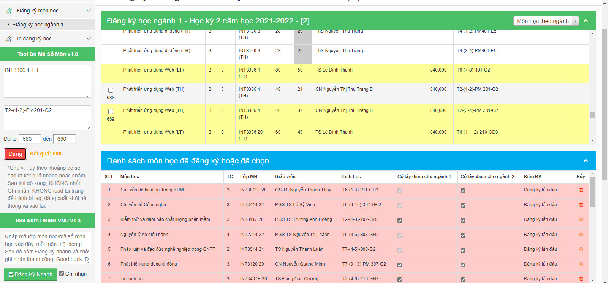

# DKMH VNU Dò mã số môn học (mã ẩn)

Tool giúp dò mã số môn học (mã ẩn), hỗ trợ cho tool Auto DKMH VNU: <https://chrome.google.com/webstore/detail/auto-dkmh-vnu/fbnkkndphognnfnaoljphdijkcpkjmoc>  

## Chức năng chính

- Dò mã số môn học khi bị ẩn.
- Hỗ trợ cho Môn học theo ngành và Môn học toàn trường.
- Hỗ trợ với lớp có tiết LT và TH.

## Hình ảnh sử dụng tool:

  

